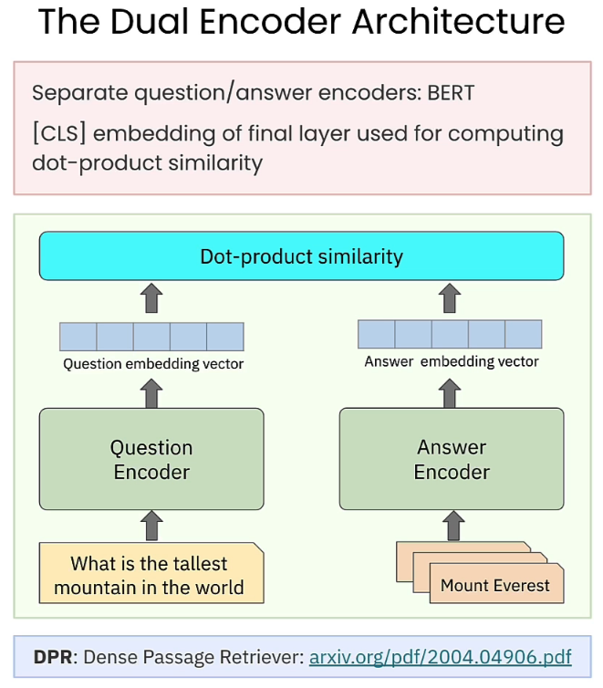

# 🧠 [Embedding Models: From Architecture to Implementation](https://www.deeplearning.ai/short-courses/embedding-models-from-architecture-to-implementation/)

Welcome to the "Embedding Models: From Architecture to Implementation" course! 🧑‍🏫 The course delves deep into the architecture and capabilities of embedding models, widely used in AI applications to capture the meaning of words and sentences.

## 📘 Course Summary
In this course, you’ll explore the evolution of embedding models, from word to sentence embeddings, and build and train a simple dual encoder model. 🧠 The hands-on approach will enable you to grasp the technical concepts behind embedding models and how to effectively use them.

**Detailed Learning Outcomes:**
1. 🧩 **Embedding Models**: Learn about word embedding, sentence embedding, and cross-encoder models, and how they are utilized in Retrieval-Augmented Generation (RAG) systems.

 

2. 🧠 **Transformer Models**: Understand how transformer models, specifically BERT (Bi-directional Encoder Representations from Transformers), are trained and used in semantic search systems.

 
 

3. 🏗️ **Dual Encoder Architecture**: Gain knowledge of the evolution of sentence embedding and understand the formation of the dual encoder architecture.

 
 

4. 🔧 **Training with Contrastive Loss**: Use contrastive loss to train a dual encoder model, with one encoder trained for questions and another for responses.

 
 

5. 🔍 **RAG Pipeline**: Utilize separate encoders for questions and answers in a RAG pipeline and observe the differences in retrieval effectiveness compared to a single encoder model.

 
 

## 🔑 Key Points
- 🏛️ **In-depth Understanding**: Gain a deep understanding of embedding model architecture and learn how to train and use them effectively in AI applications.
- 🧩 **Embedding Models in Practice**: Learn how to apply different embedding models such as Word2Vec and BERT in various semantic search systems.
- 🏋️ **Dual Encoder Training**: Build and train dual encoder models using contrastive loss to enhance the accuracy of question-answer retrieval applications.

## 👩‍🏫 About the Instructor
- 👨‍🏫 **Ofer Mendelevitch**: Head of Developer Relations at Vectara, Ofer brings extensive experience in embedding models and their implementation in real-world AI applications.

🔗 To enroll in the course or for further information, visit 📚 [deeplearning.ai](https://www.deeplearning.ai/short-courses/).
